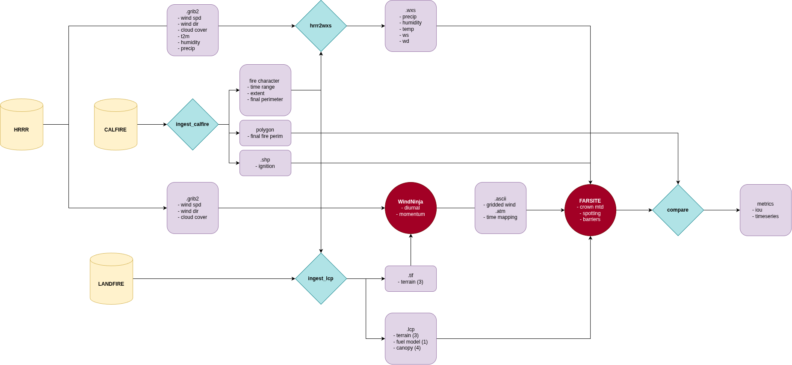

Run FARSITE simulations on preexisting California fires, and compare those simulations to the real fire perimeters.

# Requirements
- Windows
- FARSITE CLI https://www.alturassolutions.com/FB/FB_API.htm
- WindNinja CLI https://ninjastorm.firelab.org/windninja/

Once downloaded, you'll need to create a conda env
```bat
conda create -n flammap -c conda-forge python=3.12 rasterio numpy xarray cfgrib eccodes herbie-data pyshp pyproj requests timezonefinder tzdata pandas scipy matplotlib pytest tqdm
```

Set env variables:
```bat
set "GDAL_DATA=C:\path\to\FireBehaviorModels\bin\share\gdal-data"
set "WINDNINJA_DATA=C:\path\to\FireBehaviorModels\bin\share\windninja-data"
```
# Caveats

If your eccodes is borked due to Windows being a wonderful OS:
```bat
curl.exe -L -o "%USERPROFILE%\eccodes-2.49.0.zip" https://github.com/ecmwf/eccodes/archive/refs/tags/2.49.0.zip
rmdir /s /q "%USERPROFILE%\.eccodes" 2>nul
python -c "import zipfile; z=zipfile.ZipFile(r'%USERPROFILE%\eccodes-2.49.0.zip'); z.extractall(r'%USERPROFILE%\.eccodes'); print('entries:', len(z.namelist()))"
python -c "import os; d=r'%USERPROFILE%\.eccodes\eccodes-2.49.0\definitions'; print('def files:', sum(len(f) for _,_,f in os.walk(d))); print('section.1.def bytes:', os.path.getsize(os.path.join(d,'grib2','section.1.def')))"
rem expect: def files = 24115 and section.1.def bytes = 5486 (for 2.49.0)

set "ECCODES_DEFINITION_PATH=%USERPROFILE%\.eccodes\eccodes-2.49.0\definitions"
set "ECCODES_SAMPLES_PATH=%USERPROFILE%\.eccodes\eccodes-2.49.0\samples"
python -m eccodes selfcheck
```

If you have OSGeo4W installed, it will clobber your env, killing rasterio. Kick OSGeo4W out of your path for this session:
```bat
set "PATH=%PATH:C:\path\to\OSGeo4W\binaries;=%"
```

For my machine, it looks like:
```bat
set "PATH=%PATH:C:\Users\mgraca\AppData\Local\Programs\OSGeo4W\bin;=%"
```

When all is said and done, this is what I personally run to prep the environment:
```bat
set "GDAL_DATA=C:\Users\mgraca\Workspace\farsite-docker\bin\share\gdal-data" && set "WINDNINJA_DATA=C:\Users\mgraca\Workspace\farsite-docker\bin\share\windninja-data" && set "PATH=%PATH:C:\Users\mgraca\AppData\Local\Programs\OSGeo4W\bin;=%" && set "ECCODES_DEFINITION_PATH=%USERPROFILE%\.eccodes\eccodes-2.49.0\definitions" && set "ECCODES_SAMPLES_PATH=%USERPROFILE%\.eccodes\eccodes-2.49.0\samples"
```

# Config
The config controls all of the arguments that are passed into this constellation of scripts.

Make sure to edit the config to support your local environment. Wire up FARSITE and WindNinja CLI binaries! More info on usage in `docs/CONFIG.md`. If you want some examples of configs I've run, see `configs/`.


